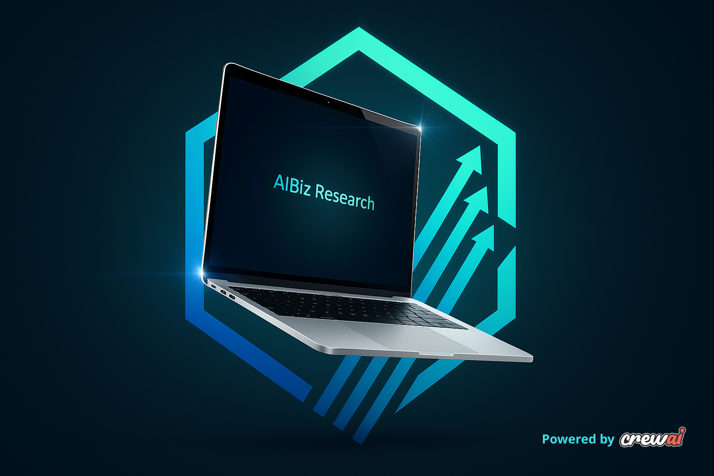

# AIBiz Research

<div style="text-align: center;">
    
</div>

## Introduction

Welcome to the AIBiz Research repo (short for AI Business Research), powered by [crewAI](https://crewai.com). This multi-agent AI system aims to help entrepeneurs and hackathon participants quickly gather relevant information and pre-validated ideas to support their first hours of brainstorming. It's very straightforward: you choose a topic and a subtopic, and the AI crew will search, analyze, validate and structure market data and potential ideas for you. 

## Installation

Ensure you have Python >=3.10 <3.14 installed on your system.

First, if you haven't already, install [uv](https://docs.astral.sh/uv/):

```bash
$ pip install uv
```

Next, navigate to your project directory and install the dependencies:

(Optional) Lock the dependencies and install them by using the CLI command:
```bash
$ crewai install
```
### Setting up 

Before running the project, you need to set up your environment variables. Create a file named `.env` in the root of your project and add the following keys:
- `MODEL`: We reccomend using the `gemini/gemini-2.0-flash-lite` model, for velocity and free pricing for a limited rate amount. 
- `GEMINI_API_KEY`, or the model equivalent api key
- `SERPER_API_KEY`: Set it up for free at the [Serper website](https://serper.dev/).

For more information in setting up the LLM model and LLM API keys, check out the [crewAI documentation](https://docs.crewai.com/en/concepts/llms).

## Running 

At the root folder, run:

```bash
$ crewai run
```

Note: This is a complex workflow and may take 2-3min to execute entirely. Time can vary since agents validate and delegate tasks to each other, so as to achieve their best work.

As a final result, two files will be created at the root folder:
- `research.md` is an overview of the market and the foundation of the research;
- `report.md` is the final document containing the business opportunities identified and the rational of they are promising, including a parallel comparison to the current market landscape. 